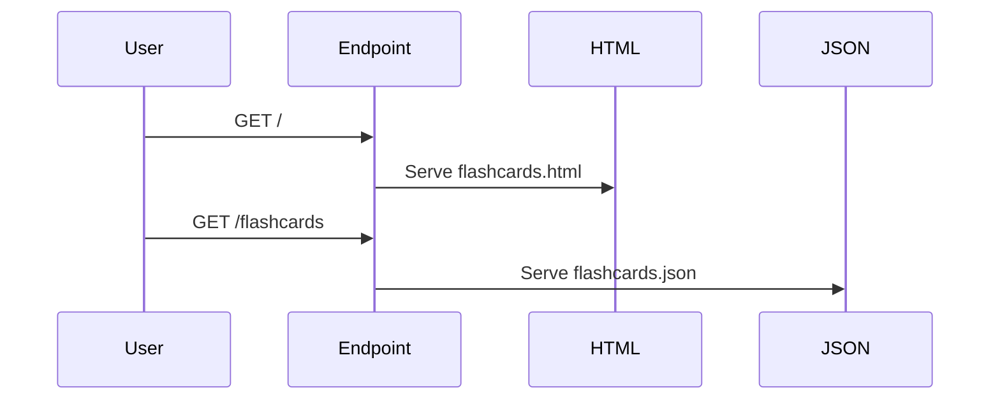

# Flashcards Application

This application is a web-based flashcard system designed to help users learn and review information interactively. It features a collection of flashcards that cover various topics, allowing users to flip between questions and answers. The app is built using FastAPI for the backend and serves HTML content to the frontend, providing a seamless and engaging learning experience.

## HTTP Call Sequence



## Building and Running the Docker Container

To build and run the Docker container for this application, follow these steps:

1. **Build the Docker Image**

   Open a terminal in the root directory of the project and run the following command to build the Docker image:

   ```bash
   docker build -t flashcards-app .
   ```

2. **Run the Docker Container**

   Once the image is built, run the container using the following command:

   ```bash
   docker run -p 8000:8000 flashcards-app
   ```

   This will start the application, and it will be accessible at `http://localhost:8000`.
